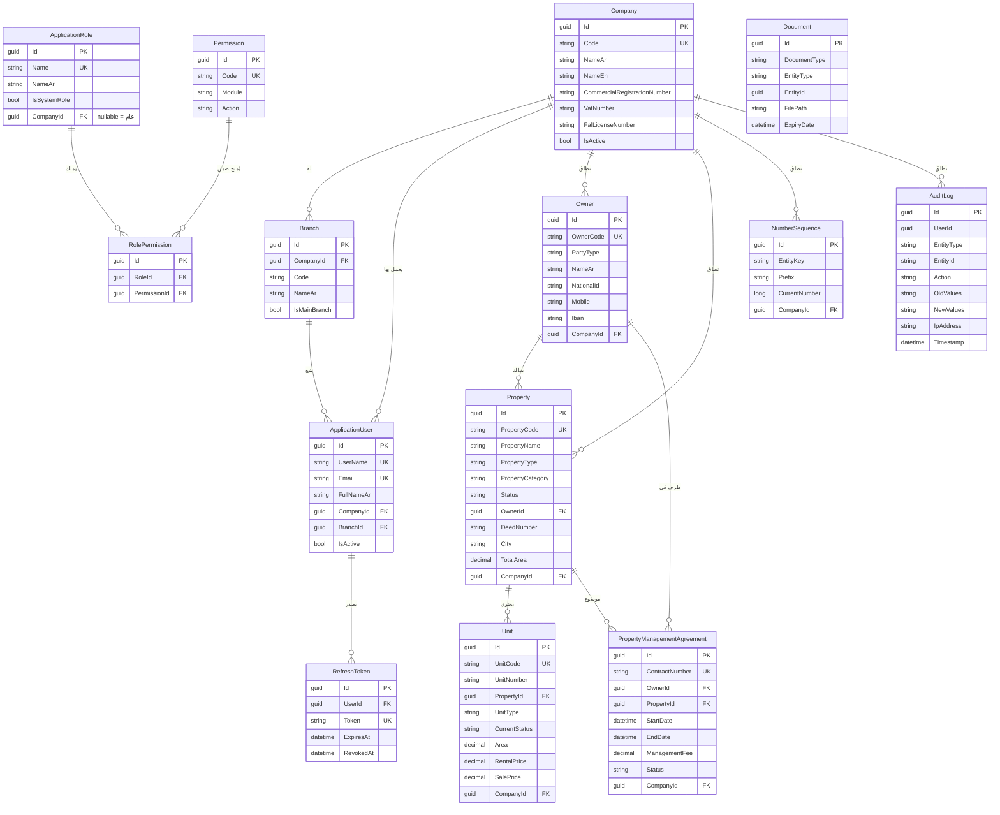

# مخطط قاعدة البيانات — الإصدار التأسيسي

قاعدة البيانات: **SQL Server**. هذا المستند يغطي الجداول المبنية فعليًا في هذا الإصدار. جداول المراحل القادمة (Leases, Payments, Maintenance, Auctions ...) موثّقة في [ROADMAP.md](./ROADMAP.md) وليست جزءًا من هذا الـ Schema بعد.

## ERD



## ملاحظات تصميمية مهمة

- **Soft Delete**: `Owner`, `Property`, `Unit`, `PropertyManagementAgreement`, `Document` تحمل `IsDeleted` + `DeletedAt` + `DeletedBy`، مع Global Query Filter في EF Core يستبعدها تلقائيًا من كل الاستعلامات. لا يوجد حذف فعلي (`DELETE`) لأي سجل عمل.
- **الفهرسة (Indexes)**: فهارس فريدة مركّبة على `(CompanyId, Code)` لكل الجداول ذات الترقيم المرجعي، وفهارس على الحقول المستخدمة في البحث/الفلترة (الحالة، المدينة، رقم الجوال، رقم الصك، التواريخ) تحقيقًا لمتطلب الأداء تحت آلاف السجلات.
- **الدقة المالية**: كل الحقول المالية (`decimal`) بدقة `(18,2)` لتفادي أخطاء التقريب.
- **RowVersion**: `NumberSequence` يحمل `RowVersion` (Concurrency Token) كحماية إضافية، رغم أن الآلية الأساسية لمنع التعارض هي عبارة SQL ذرّية (راجع ARCHITECTURE.md، البند 7).
- **AuditLog بلا FK صارم على المستخدم**: `UserId` بلا Foreign Key قسري حتى يبقى السجل قابلاً للقراءة حتى لو حُذف المستخدم مستقبلاً (وإن كان الحذف الفعلي للمستخدمين غير متوقَّع أصلًا).

## أمر توليد الـ Migration الفعلي

ملفات EF Core Migrations لم تُولَّد داخل هذه الجلسة (بيئة التطوير السحابية هنا محجوبة عن NuGet)، لكن كل الكيانات وإعدادات EF (Fluent API) جاهزة بالكامل. نفّذ من جذر المشروع بعد `dotnet restore`:

```bash
dotnet tool install --global dotnet-ef
cd src/Backend
dotnet ef migrations add InitialCreate \
  --project FalakAlkhair.Infrastructure \
  --startup-project FalakAlkhair.API \
  --output-dir Persistence/Migrations

dotnet ef database update \
  --project FalakAlkhair.Infrastructure \
  --startup-project FalakAlkhair.API
```
