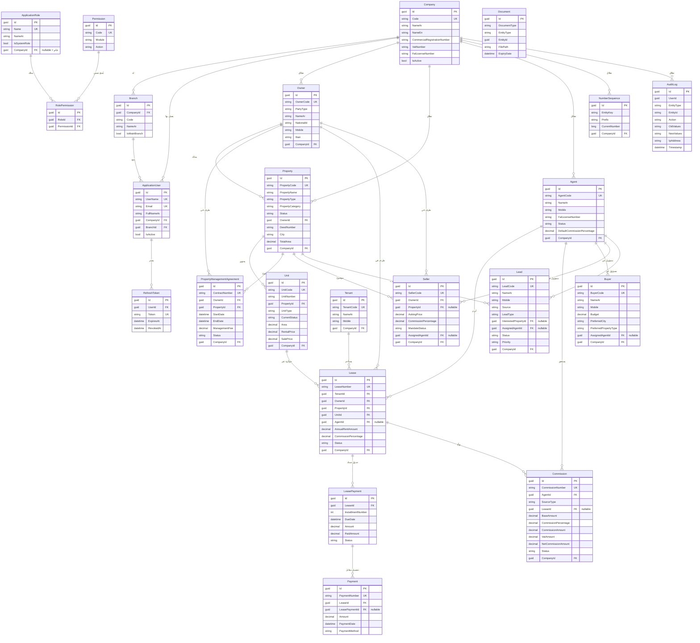

# مخطط قاعدة البيانات — حتى نهاية Phase 6

قاعدة البيانات: **SQL Server**. هذا المستند يغطي الجداول المبنية فعليًا حتى Phase 6 (Properties/Units/Owners، Tenants/Leases/Payments، Agents/Buyers/Sellers/Leads/Commissions، Listings/MarketingCampaigns/Viewings/Offers/Sales، MaintenanceRequests/MaintenanceEmployees/Vendors/MaintenanceQuotations). جداول المراحل القادمة (Auctions ...) موثّقة في [ROADMAP.md](./ROADMAP.md) وليست جزءًا من هذا الـ Schema بعد.

جداول Phase 6 الإضافية: `MaintenanceEmployee`، `Vendor`، `MaintenanceRequest` (PropertyId, UnitId, TenantId?, RequestType, Priority, Status, AssignedEmployeeId?, AssignedVendorId?)، `MaintenanceQuotation` + `MaintenanceQuotationItem` (بند بكمية وسعر وحدة، المجموع محسوب من الخادم). كل هذه الكيانات ترث `BaseAuditableEntity` عدا `MaintenanceQuotationItem` (كيان بسيط `BaseEntity` بلا Soft Delete، يتبع دورة حياة `MaintenanceQuotation` الأب).

جداول Phase 5 الإضافية (راجع الكيانات في `FalakAlkhair.Domain/Entities`): `Listing` (PropertyId, UnitId, ListingType, Price, Status)، `MarketingCampaign` (Channel, Budget, ActualCost, PropertyId, AgentId — وLeads مرتبطة عبر `Lead.CampaignId`)، `Viewing` (PropertyId, UnitId, BuyerId/TenantId, ScheduledAt, Status)، `Offer` (BuyerId, UnitId, Amount, Status)، `Sale` (PropertyId, UnitId, SellerId, BuyerId, Stage, FinalPrice — وCommission مرتبطة عبر `Commission.SaleId`). كل هذه الكيانات ترث `BaseAuditableEntity` بنفس ضمانات Soft Delete/Audit/Multi-Company الموثّقة أدناه.

## ERD



## ملاحظات تصميمية مهمة

- **Soft Delete**: كل الكيانات التي ترث `BaseAuditableEntity` (`Owner`, `Property`, `Unit`, `PropertyManagementAgreement`, `Document`, `Tenant`, `Lease`, `LeasePayment`, `Payment`, `Agent`, `Buyer`, `Seller`, `Lead`, `Commission`) تحمل `IsDeleted` + `DeletedAt` + `DeletedBy`، مع Global Query Filter في EF Core يستبعدها تلقائيًا من كل الاستعلامات. لا يوجد حذف فعلي (`DELETE`) لأي سجل عمل.
- **عمولات المسوّقين تلقائية**: `Commission` لا تُنشأ يدويًا في المسار الطبيعي — تُولَّد تلقائيًا عند تفعيل `Lease` له `AgentId` ونسبة عمولة > صفر (راجع `ActivateLeaseCommand` وROADMAP.md، Phase 4). `POST /api/commissions` مخصص فقط لحالات استثنائية يدوية.
- **مزامنة عدّادات الترقيم مع بيانات البذر (Seed)**: أي كيان يُزرَع ببيانات تطويرية بكود ثابت (`Owner.OwnerCode = "OWNER-000001"` مثلًا) يجب أن يُسجَّل أيضًا في `EnsureNumberSequenceSeededAsync` بنهاية `ApplicationDbContextSeed.SeedAsync`، وإلا فسيصطدم أول طلب فعلي عبر الـ API لنفس النوع بقيد التفرّد (Unique Index) — هذا خطأ تم اكتشافه وإصلاحه فعليًا أثناء بناء Phase 4 (راجع ROADMAP.md).
- **الفهرسة (Indexes)**: فهارس فريدة مركّبة على `(CompanyId, Code)` لكل الجداول ذات الترقيم المرجعي، وفهارس على الحقول المستخدمة في البحث/الفلترة (الحالة، المدينة، رقم الجوال، رقم الصك، التواريخ) تحقيقًا لمتطلب الأداء تحت آلاف السجلات.
- **الدقة المالية**: كل الحقول المالية (`decimal`) بدقة `(18,2)` لتفادي أخطاء التقريب.
- **RowVersion**: `NumberSequence` يحمل `RowVersion` (Concurrency Token) كحماية إضافية، رغم أن الآلية الأساسية لمنع التعارض هي عبارة SQL ذرّية (راجع ARCHITECTURE.md، البند 7).
- **AuditLog بلا FK صارم على المستخدم**: `UserId` بلا Foreign Key قسري حتى يبقى السجل قابلاً للقراءة حتى لو حُذف المستخدم مستقبلاً (وإن كان الحذف الفعلي للمستخدمين غير متوقَّع أصلًا).

## الـ Migrations

على عكس الإصدارات التأسيسية الأولى (Phase 1/2 حيث لم يتوفر وصول لـ NuGet)، migrations هذا الإصدار **مُولَّدة فعليًا وموجودة في المستودع** (`src/Backend/FalakAlkhair.Infrastructure/Persistence/Migrations/`):

1. `InitialCreate` — Phase 1/2 (Companies, Branches, Identity, Permissions, Owners, Properties, Units, PropertyManagementAgreement).
2. `AddTenantsLeasesPayments` — Phase 3 (Tenants, Leases, LeasePayments, Payments).
3. `AddAgentsBuyersSellersLeadsCommissions` — Phase 4 (Agents, Buyers, Sellers, Leads, Commissions, وإضافة `Lease.AgentId`).

كل migration من الثلاثة أعلاه **طُبِّق فعليًا** على SQL Server 2022 حقيقي (Docker) وتم التحقق من عمل النظام الكامل (Seed، تسجيل الدخول، CRUD عبر كل Endpoint) قبل رفعه — وليس كودًا مكتوبًا يدويًا بلا اختبار.

عند إضافة كيانات جديدة مستقبلًا، نفّذ من `src/Backend` بعد `dotnet restore`:

```bash
dotnet tool install --global dotnet-ef
dotnet ef migrations add <MigrationName> \
  --project FalakAlkhair.Infrastructure \
  --startup-project FalakAlkhair.API \
  --output-dir Persistence/Migrations

dotnet ef database update \
  --project FalakAlkhair.Infrastructure \
  --startup-project FalakAlkhair.API
```
